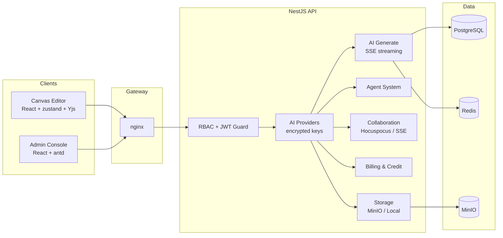

<p align="center">
  
  
  
  
  
</p>

<h1 align="center">ZeroExo Platform</h1>

<p align="center">
  An open-source, AI-driven canvas + auto film-out pipeline. From idea to storyboard, from shots to a finished short film — one platform, end to end.
</p>

<p align="center">
  <a href="README.zh-CN.md">简体中文</a> · <a href="#who-its-for">Who It's For</a> · <a href="#product-modules">Modules</a> · <a href="#roadmap">Roadmap</a> · <a href="#quick-start">Quick Start</a>
</p>

---

## Early Development Notice

> **This project is in EARLY development.** APIs, UI, and data models change
> frequently as the product evolves. We ship fast and sometimes rough —
> expect breaking changes, expect me pushing commits at 3 AM. If you can
> live with that, welcome aboard; if you need a stable 1.0, star us and
> come back later. Contributions and feedback are very welcome.

## Who It's For

ZeroExo is built **by and for short-video creators, film/TV self-media
operators, and storyboard artists** — the people who currently pay for
expensive, locked-down, closed-source online tools that own your workflow
and your data. This project is an **open-source alternative to those
overpriced commercial services**: self-hosted, self-controlled, and
purpose-built for the canvas + AI production workflow rather than a
dashboard bolted onto a generic editor.

## Highlights

- **Plugin-based infinite canvas** — a self-built React DOM canvas engine
  (no ReactFlow): viewport transforms, grid spatial index, multi-level LOD,
  per-node subscription, merged non-active edges. Extended through
  `@zeroexo/*` workspace plugins.
- **AI film-out workflow** — agents for script writing, storyboard breaking,
  shot design, and canvas operations; every node can chat with AI to pull
  research, comparisons, and real data.
- **Real-time collaboration** — Hocuspocus (Yjs) document sync plus
  JWT-protected SSE event channels, with offline-first sync and conflict
  rebasing by timestamp.
- **Asset & prompt library** — local/object-storage asset management and a
  shared, license-aware prompt library.
- **Admin console** — API provider management, user onboarding approval,
  prompt library, branding, multi-language policies, and ECharts analytics.
- **Billing & credit** — plans, subscriptions, credit accounting,
  reconciliation, and daily reports.
- **Security by default** — fail-fast secrets, storage key validation,
  throttling whitelist, and a signed update chain for the desktop launcher.

## Product Modules

### Frontend — Canvas (the core)

The canvas editor is the platform's core module, covering the complete
production pipeline of script → storyboard → shot → finished film:

| Area | What it does |
|------|--------------|
| Canvas core | Viewport pan/zoom, grid spatial index, multi-level LOD rendering, node subscription, node/edge selection & editing, group/arrange/size/layer tools |
| Node system | Video, image, text, stacked, and generator nodes; per-type colors and icons; AI chat per node |
| Collaboration | Yjs + Hocuspocus real-time sync, presence/awareness, offline-first local persistence, timestamp-based conflict rebasing |
| AI production | Agent dock, streamed thinking UI, canvas agents (storyboard, shot, genre analysis), AI chat composer with @-mentions |
| Storyboard & script | Rich-text script editor, storyboard episodes, shot lists, script import & conversion |
| Material & prompt | Asset library, prompt library with favorites, resource sync (cloud-first) |

| Canvas core | Collaboration | AI production |
|---|---|---|
| `docs/screenshots/frontend/canvas-core.png` | `docs/screenshots/frontend/collaboration.png` | `docs/screenshots/frontend/ai-production.png` |

> Placeholder paths — screenshots are being prepared and will be added soon.

### Admin Console

Operational control plane for the platform:

- API provider management (credentials, health checks, per-user keys)
- User management & application approval (RBAC: `super_admin` / `admin` / `operator` / `user`)
- Prompt library, branding, multi-language policies
- Analytics dashboards (operations & billing) built on ECharts

| Dashboard | Provider management |
|---|---|
| `docs/screenshots/admin/dashboard.png` | `docs/screenshots/admin/providers.png` |

### Backend API

A NestJS + Prisma service layer: authentication & refresh rotation, role-based
guards, AI provider orchestration with encrypted key storage (AES-256-GCM),
SSE streaming, asset storage (MinIO / local), collaboration backend, billing,
and analytics.

> The backend provides the capability foundation for the canvas editor and
> the admin console. See the per-module READMEs for details.

## Roadmap

What's being built next, in priority order:

1. **Smart film-splitting (拉片拆片)** — feed a reference video, get it
   broken into shots/scenes/storyboard automatically.
2. **Million-word novel breakdown** — one-click structural decomposition of
   long-form novels into chapters, scenes, and shot-ready storyboards.
   (Shell already in place.)
3. **Pre-shoot white-model preview** — auto-generate a staged preview
   ("previsualization") of every decomposed shot, with camera movement and
   layout. The manual Blender modeling step is replaced by an automated,
   one-click preview pass.

More on the horizon: better multi-provider AI orchestration, marketplace
hooks for the idea → platform → revenue loop, and production-grade
collaboration tooling.

## Quick Start

### Option A: Docker Compose (recommended)

```bash
git clone <your-repo-url>
cd zeroexo-platform
cp zeroexo_backend/.env.example zeroexo_backend/.env   # then edit secrets
docker compose up -d
```

| Service   | URL                     |
|-----------|-------------------------|
| Frontend (canvas) | http://localhost:80 |
| Admin     | http://localhost:80/admin/ |
| API       | http://localhost:3000 |
| Swagger   | http://localhost:3000/api/docs |

### Option B: Local development

Prerequisites: Node.js >= 18, pnpm >= 9, PostgreSQL 16, Redis 7, MinIO.

```bash
# 1. Backend
cd zeroexo_backend
cp .env.example .env
pnpm install
npx prisma migrate deploy && npx prisma generate
pnpm db:seed          # create initial accounts (password via SEED_SUPER_ADMIN_PASSWORD)
pnpm dev              # http://localhost:3000

# 2. Admin console
cd ../zeroexo_admin
pnpm install
pnpm dev              # http://localhost:8080

# 3. Frontend (canvas)
cd ../zeroexo_front
pnpm install
pnpm dev              # http://localhost:5180
```

> Initial accounts are created by `pnpm db:seed`. In production the
> super-admin password is read from `SEED_SUPER_ADMIN_PASSWORD` and the
> seed script refuses to run with the default value.

## Architecture



## Repository Structure

```
zeroexo-platform/
├── zeroexo_front/          # Canvas editor (the core product)
│   ├── packages/           # @zeroexo/* plugins: nodes, layout, group, history ...
│   └── src/                # app shell, features, sync, collaboration
├── zeroexo_admin/          # Admin console (React + antd + ECharts)
├── zeroexo_backend/        # NestJS API (Prisma, PostgreSQL, Redis, MinIO)
│   ├── prisma/             # schema, migrations, seeders
│   └── src/modules/        # auth, ai-generate, agent, assets, billing, ...
├── docs/screenshots/       # screenshots per module (frontend/admin/backend)
├── docker-compose.yml      # one-command deployment
└── docker/nginx/           # reverse proxy config
```

## Tech Stack

| Layer    | Technology |
|----------|------------|
| Canvas   | React 18, Vite 6, pnpm workspace, Turbo, Yjs, zustand, Vitest |
| Admin    | React 18, Vite 8, antd 6, ProComponents, ECharts, i18next |
| Backend  | NestJS 10, Prisma 5, PostgreSQL 16, Redis 7, MinIO, OpenTelemetry |
| Realtime | Hocuspocus (Yjs), Server-Sent Events |
| Security | JWT + refresh rotation, RBAC, rate limiting, AES-256-GCM |
| Deploy   | Docker Compose, nginx, PM2 (ecosystem.config.js) |

## Scripts

See the per-module READMEs:

- [zeroexo_front](zeroexo_front/README.md) — `pnpm dev` / `pnpm build` / `pnpm typecheck` / `pnpm test`
- [zeroexo_admin](zeroexo_admin/README.md) — `pnpm dev` / `pnpm build` / `pnpm lint`
- [zeroexo_backend](zeroexo_backend/README.md) — `pnpm dev` / `pnpm build` / `pnpm typecheck` / `pnpm db:seed`

## Contributing

Contributions are welcome. Please read [CONTRIBUTING.md](CONTRIBUTING.md) and
check [SECURITY.md](SECURITY.md) for reporting vulnerabilities.

## License

[MIT](LICENSE) © RenderTool <750831855@qq.com>
