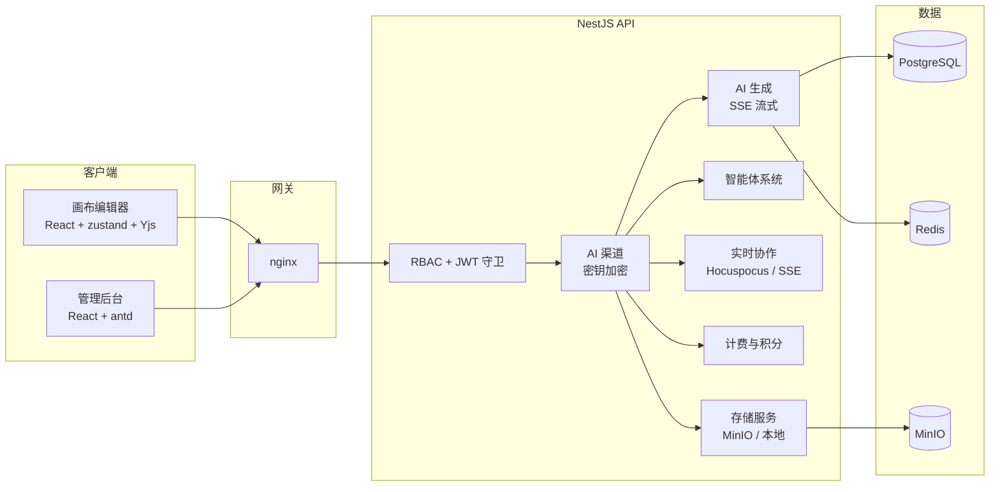

<p align="center">
  
  
  
  
  
</p>

<h1 align="center">ZeroExo Platform</h1>

<p align="center">
  全栈、AI 驱动的画布平台。从创意到分镜、从镜头到成片，一个平台端到端完成。
</p>

<p align="center">
  <a href="README.md">English</a> · <a href="#产品模块">产品模块</a> · <a href="#路线图">路线图</a> · <a href="#快速开始">快速开始</a>
</p>

---

> **早期开发** — API、界面与数据模型会频繁变更。欢迎贡献与反馈。

### 核心亮点

- **无限画布** — 自研 React DOM 引擎，节点编排、多级 LOD、网格空间索引
- **AI 出片流水线** — 剧本 → 分镜 → 镜头 → 成片；每个节点可 AI 对话
- **实时协作** — Yjs CRDT + Hocuspocus，离线优先、时间戳冲突变基

### 最新预览（v1.2.0）

| 提示词查看器（生成链路画布） | 流式画布编辑 |
|---|---|
|  |  |

## 产品模块

| 前端画布 | 管理后台 |
|---|---|
|  |  |

ZeroExo 是一个**全栈项目**。前端 React 画布是核心产品，后端 NestJS 驱动的管理后台提供运营控制能力 — 前后端分离，一体部署。

### 首页


### 画布能力展示

| 画布概览 | 快捷键 | 节点样式配置 |
|---|---|---|
|  |  |  |

| 调试与协作 | 项目工程开发配套 Agent | Agent 自我升级与维护 |
|---|---|---|
|  |  |  |

### 动态演示（画布操作）

**实时协作编辑**

多人同时在线编辑同一画布，基于 Yjs 与 Hocuspocus 实现实时同步与离线优先本地持久化，操作结果即时可见。


**堆叠节点收纳**

将多个节点一键聚合为堆叠节点，支持展开、切换与移出，实现节点的分组管理与紧凑排布。


**节点快速定位**

通过节点导航控件快速定位与聚焦画布节点，提升大规模画布下的浏览与编辑效率。


**层级面板与双击聚焦**

层级面板以树状结构总览节点关系，双击节点即时聚焦视口，兼顾全局视图与局部编辑。


**多语言切换**

一键实时切换中文、英文、日文界面语言。


**画布换肤**

在浅色与深色主题间自由切换，所有页面 UI 元素随主题完整适配。


### 前端 — 画布（核心）

画布编辑器是平台的核心模块，覆盖「剧本 → 分镜 → 镜头 → 成片」的完整制作流程：

| 模块 | 说明 |
|------|------|
| 画布核心 | 视口平移缩放、网格空间索引、多级 LOD 渲染、节点订阅、节点/边选中与编辑、分组 / 排列 / 尺寸 / 层序工具 |
| 节点系统 | 视频、图片、文本、堆叠与生成节点；按类型配置颜色与图标；每个节点可 AI 对话 |
| 画布协作 | Yjs + Hocuspocus 实时同步、在线状态感知、离线优先本地持久化、基于时间戳的冲突 rebase |
| AI 出片 | 智能体停靠栏、流式思考 UI、画布智能体（分镜 / 镜头 / 题材分析）、支持 @ 提及的 AI 对话创作 |
| 分镜与剧本 | 富文本剧本编辑器、分镜集数、镜头列表、剧本导入与转换 |
| 素材与提示词 | 素材库、可收藏的提示词库、资源同步（云优先） |

#### 界面预览

| 登录页 | 首页 | 白色主题 |
|---|---|---|
|  |  |  |

| 剧本编辑 | 剧本与分镜 | 分镜编辑 |
|---|---|---|
|  |  |  |

| 提示词库 | 素材库 | 画布管理 |
|---|---|---|
|  |  |  |

### 管理后台

平台运营控制面：

- API 渠道管理（凭据、健康检测、用户级密钥）
- 用户管理与入驻审核（RBAC：`super_admin` / `admin` / `operator` / `user`）
- 提示词库、品牌定制、多语言政策
- 基于 ECharts 的运营与计费数据看板

#### 界面预览

| 后台首页 | 站点运营 | 用户资产权限管理 |
|---|---|---|
|  |  |  |

| API 渠道管理 | 渠道详情 | 存储 |
|---|---|---|
|  |  |  |

| 站点管理 | 日志 | 邮件服务 |
|---|---|---|
|  |  |  |

### 后端 API

NestJS + Prisma 服务层：认证与 refresh 轮换、基于角色的守卫、AI 渠道编排（密钥 AES-256-GCM 加密存储）、SSE 流式、素材存储（MinIO / 本地）、协作后端、计费与数据分析。

> 后端为画布编辑器与管理后台提供能力支撑，模块说明详见各子项目 README。

## 路线图

按优先级推进：

1. **智能拉片拆片** — 输入参考视频，自动拆分为镜头 / 场景 / 分镜。
2. **百万小说智能拆解** — 长篇小说一键结构化拆解为章节、场景与可直接拍摄的分镜（壳已就位）。
3. **超前白模预览** — 对已拆解的分镜自动生成编排预演（previsualization），含运镜与布景。手动 Blender 建模环节替换为全自动化一键预演。

更远的计划：面向「创意 → 上架 → 营收」闭环的插件市场、生产级协作工具链。

## 快速开始

### 方式 A：Docker Compose（推荐）

```bash
git clone <你的仓库地址>
cd zeroexo-platform
cp zeroexo_backend/.env.example zeroexo_backend/.env   # 然后修改密钥
docker compose up -d
```

创建初始管理员账号（super_admin）：

```bash
# seed 必须通过环境变量提供强密码（生产环境下 seed 会拒绝使用默认值）
docker compose exec backend sh -c \
  "SEED_SUPER_ADMIN_PASSWORD='<强密码>' \
   SEED_ADMIN_PASSWORD='<强密码>' \
   SEED_USER_PASSWORD='<强密码>' \
   npx ts-node prisma/seed.ts"
```

| 服务     | 地址                          |
|----------|-------------------------------|
| 前端画布 | http://localhost:80           |
| 管理后台 | http://localhost:80/admin/    |
| API      | http://localhost:3000         |
| Swagger  | http://localhost:3000/api/docs |

### 方式 B：本地开发

环境要求：Node.js >= 18、pnpm >= 9、PostgreSQL 16、Redis 7、MinIO。

```bash
# 1. 后端
cd zeroexo_backend
cp .env.example .env
pnpm install
npx prisma migrate deploy && npx prisma generate
pnpm db:seed          # 创建初始账户（密码通过 SEED_SUPER_ADMIN_PASSWORD 指定）
pnpm dev              # http://localhost:3000

# 2. 管理后台
cd ../zeroexo_admin
pnpm install
pnpm dev              # http://localhost:8080

# 3. 前端画布
cd ../zeroexo_front
pnpm install
pnpm dev              # http://localhost:5180
```

> 初始账户由 `pnpm db:seed` 创建。生产环境超级管理员密码读取
> `SEED_SUPER_ADMIN_PASSWORD` 环境变量，脚本拒绝使用默认密码执行。

## 架构



## 仓库结构

```
zeroexo-platform/
├── zeroexo_front/          # 画布编辑器（核心产品）
│   ├── packages/           # @zeroexo/* 插件：nodes、layout、group、history ...
│   └── src/                # 应用外壳、功能模块、同步、协作
├── zeroexo_admin/          # 管理后台（React + antd + ECharts）
├── zeroexo_backend/        # NestJS API（Prisma / PostgreSQL / Redis / MinIO）
│   ├── prisma/             # schema、migrations、种子脚本
│   └── src/modules/        # 认证、AI 生成、智能体、素材、计费 ...
├── docs/screenshots/       # 各模块截图（frontend / canvas / admin）
├── docker-compose.yml      # 一键部署
└── docker/nginx/           # 反向代理配置
```

## 技术栈

| 分层     | 技术                                                         |
|----------|--------------------------------------------------------------|
| 画布     | React 18、Vite 6、pnpm workspace、Turbo、Yjs、zustand、Vitest |
| 管理后台 | React 18、Vite 8、antd 6、ProComponents、ECharts、i18next    |
| 后端     | NestJS 10、Prisma 5、PostgreSQL 16、Redis 7、MinIO、OpenTelemetry |
| 实时     | Hocuspocus (Yjs)、Server-Sent Events                         |
| 安全     | JWT + refresh 轮换、RBAC、限流、AES-256-GCM                  |
| 部署     | Docker Compose、nginx、PM2（ecosystem.config.js）             |

## 常用脚本

详见各模块 README：

- [zeroexo_front](zeroexo_front/README.md) — `pnpm dev` / `pnpm build` / `pnpm typecheck` / `pnpm test`
- [zeroexo_admin](zeroexo_admin/README.md) — `pnpm dev` / `pnpm build` / `pnpm lint`
- [zeroexo_backend](zeroexo_backend/README.md) — `pnpm dev` / `pnpm build` / `pnpm typecheck` / `pnpm db:seed`

## 参与贡献

欢迎提交 Issue 与 PR，请先阅读 [CONTRIBUTING.md](CONTRIBUTING.md)；安全漏洞上报请查看 [SECURITY.md](SECURITY.md)。

## 许可证

[MIT](LICENSE) © 斯高和 <750831855@qq.com>
