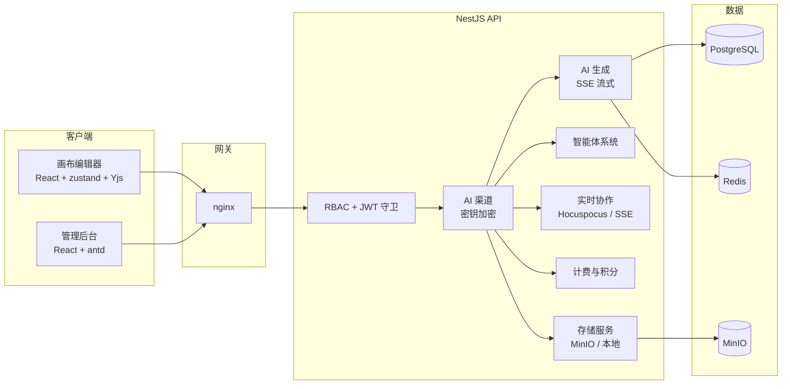

<p align="center">
  
  
  
  
  
</p>

<h1 align="center">ZeroExo Platform</h1>

<p align="center">
  开源 AI 驱动画布 + 智能出片全链路平台：从创意到分镜、从镜头到成片，一个平台端到端完成。
</p>

<p align="center">
  <a href="README.md">English</a> · <a href="#服务对象">服务对象</a> · <a href="#产品模块">产品模块</a> · <a href="#路线图">路线图</a> · <a href="#快速开始">快速开始</a>
</p>

---

## 早期开发提示

> **本项目处于早期开发阶段。** API、界面与数据模型会随产品演进而频繁变更。
> 我们快速迭代、偶有粗糙——请预期破坏性更新，甚至可能看到我在凌晨三点
> 推代码。如果你能接受这种节奏，欢迎加入；如果你需要稳定的 1.0，
> 先点个 star，稍后再回来。非常欢迎贡献与反馈。

## 服务对象

ZeroExo 短视频创作者、影视自媒体从业者与分镜师**为自己打造**——

## 核心亮点

- **插件化无限画布** — 自研 React DOM 画布引擎（不依赖 ReactFlow）：视口变换、网格空间索引、多级 LOD、per-node 订阅、非活跃边合并。通过 `@zeroexo/*` workspace 插件扩展。
- **AI 智能出片工作流** — 剧本创作、分镜拆解、镜头设计、画布操作等智能体；每个节点都可与 AI 对话，获取调研、对比与真实数据。
- **实时协作** — Hocuspocus (Yjs) 文档同步叠加 JWT 保护的 SSE 事件通道，支持离线优先同步与基于时间戳的冲突 rebase。
- **素材与提示词库** — 本地 / 对象存储素材管理，共享且带授权感知的提示词库。
- **管理后台** — API 渠道管理、用户与入驻审核、提示词库、品牌定制、多语言政策、ECharts 数据看板。
- **计费与积分** — 套餐、订阅、积分核算、对账与日报。
- **安全默认** — 密钥 fail-fast、存储 Key 校验、限流白名单、桌面启动器签名校验链。

## 产品模块

### 前端 — 画布（核心）

画布编辑器是平台的核心模块，覆盖「剧本 → 分镜 → 镜头 → 成片」的完整制作流程：

| 模块 | 说明 |
|------|------|
| 画布核心 | 视口平移缩放、网格空间索引、多级 LOD 渲染、节点订阅、节点/边选中与编辑、分组 / 排列 / 尺寸 / 层序工具 |
| 节点系统 | 视频、图片、文本、堆叠与生成节点；按类型配置颜色与图标；每个节点可 AI 对话 |
| 画布协作 | Yjs + Hocuspocus 实时同步、在线状态感知、离线优先本地持久化、基于时间戳的冲突 rebase |
| AI 出片 | 智能体停靠栏、流式思考 UI、画布智能体（分镜 / 镜头 / 题材分析）、支持 @ 提及的 AI 对话创作 |
| 分镜与剧本 | 富文本剧本编辑器、分镜集数、镜头列表、剧本导入与转换 |
| 素材与提示词 | 素材库、可收藏的提示词库、资源同步（云优先） |

| 画布核心 | 画布协作 | AI 出片 |
|---|---|---|
| `docs/screenshots/frontend/canvas-core.png` | `docs/screenshots/frontend/collaboration.png` | `docs/screenshots/frontend/ai-production.png` |

> 以上为占位路径，截图正在准备中，后续将补充。

### 管理后台

平台运营控制面：

- API 渠道管理（凭据、健康检测、用户级密钥）
- 用户管理与入驻审核（RBAC：`super_admin` / `admin` / `operator` / `user`）
- 提示词库、品牌定制、多语言政策
- 基于 ECharts 的运营与计费数据看板

| 数据看板 | 渠道管理 |
|---|---|
| `docs/screenshots/admin/dashboard.png` | `docs/screenshots/admin/providers.png` |

### 后端 API

NestJS + Prisma 服务层：认证与 refresh 轮换、基于角色的守卫、AI 渠道编排（密钥 AES-256-GCM 加密存储）、SSE 流式、素材存储（MinIO / 本地）、协作后端、计费与数据分析。

> 后端为画布编辑器与管理后台提供能力支撑，模块说明详见各子项目 README。

## 路线图

按优先级推进：

1. **智能拉片拆片** — 输入参考视频，自动拆分为镜头 / 场景 / 分镜。
2. **百万小说智能拆解** — 长篇小说一键结构化拆解为章节、场景与可直接拍摄的分镜（壳已就位）。
3. **超前白模预览** — 对已拆解的分镜自动生成编排预演（previsualization），含运镜与布景。手动 Blender 建模环节替换为全自动化一键预演。

更远的计划：面向「创意 → 上架 → 营收」闭环的插件市场、生产级协作工具链。

## 快速开始

### 方式 A：Docker Compose（推荐）

```bash
git clone <你的仓库地址>
cd zeroexo-platform
cp zeroexo_backend/.env.example zeroexo_backend/.env   # 然后修改密钥
docker compose up -d
```

| 服务     | 地址                          |
|----------|-------------------------------|
| 前端画布 | http://localhost:80           |
| 管理后台 | http://localhost:80/admin/    |
| API      | http://localhost:3000         |
| Swagger  | http://localhost:3000/api/docs |

### 方式 B：本地开发

环境要求：Node.js >= 18、pnpm >= 9、PostgreSQL 16、Redis 7、MinIO。

```bash
# 1. 后端
cd zeroexo_backend
cp .env.example .env
pnpm install
npx prisma migrate deploy && npx prisma generate
pnpm db:seed          # 创建初始账户（密码通过 SEED_SUPER_ADMIN_PASSWORD 指定）
pnpm dev              # http://localhost:3000

# 2. 管理后台
cd ../zeroexo_admin
pnpm install
pnpm dev              # http://localhost:8080

# 3. 前端画布
cd ../zeroexo_front
pnpm install
pnpm dev              # http://localhost:5180
```

> 初始账户由 `pnpm db:seed` 创建。生产环境超级管理员密码读取
> `SEED_SUPER_ADMIN_PASSWORD` 环境变量，脚本拒绝使用默认密码执行。

## 架构



## 仓库结构

```
zeroexo-platform/
├── zeroexo_front/          # 画布编辑器（核心产品）
│   ├── packages/           # @zeroexo/* 插件：nodes、layout、group、history ...
│   └── src/                # 应用外壳、功能模块、同步、协作
├── zeroexo_admin/          # 管理后台（React + antd + ECharts）
├── zeroexo_backend/        # NestJS API（Prisma / PostgreSQL / Redis / MinIO）
│   ├── prisma/             # schema、migrations、种子脚本
│   └── src/modules/        # 认证、AI 生成、智能体、素材、计费 ...
├── docs/screenshots/       # 各模块截图（frontend / admin / backend）
├── docker-compose.yml      # 一键部署
└── docker/nginx/           # 反向代理配置
```

## 技术栈

| 分层     | 技术                                                         |
|----------|--------------------------------------------------------------|
| 画布     | React 18、Vite 6、pnpm workspace、Turbo、Yjs、zustand、Vitest |
| 管理后台 | React 18、Vite 8、antd 6、ProComponents、ECharts、i18next    |
| 后端     | NestJS 10、Prisma 5、PostgreSQL 16、Redis 7、MinIO、OpenTelemetry |
| 实时     | Hocuspocus (Yjs)、Server-Sent Events                         |
| 安全     | JWT + refresh 轮换、RBAC、限流、AES-256-GCM                  |
| 部署     | Docker Compose、nginx、PM2（ecosystem.config.js）             |

## 常用脚本

详见各模块 README：

- [zeroexo_front](zeroexo_front/README.md) — `pnpm dev` / `pnpm build` / `pnpm typecheck` / `pnpm test`
- [zeroexo_admin](zeroexo_admin/README.md) — `pnpm dev` / `pnpm build` / `pnpm lint`
- [zeroexo_backend](zeroexo_backend/README.md) — `pnpm dev` / `pnpm build` / `pnpm typecheck` / `pnpm db:seed`

## 参与贡献

欢迎提交 Issue 与 PR，请先阅读 [CONTRIBUTING.md](CONTRIBUTING.md)；安全漏洞上报请查看 [SECURITY.md](SECURITY.md)。

## 许可证

[MIT](LICENSE) © RenderTool <750831855@qq.com>
