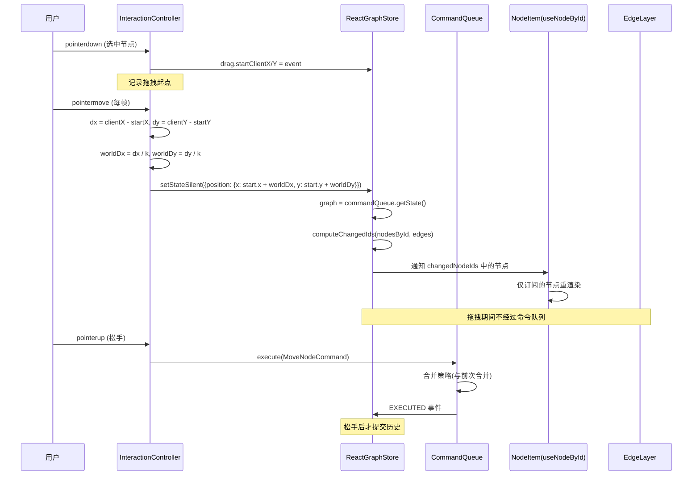
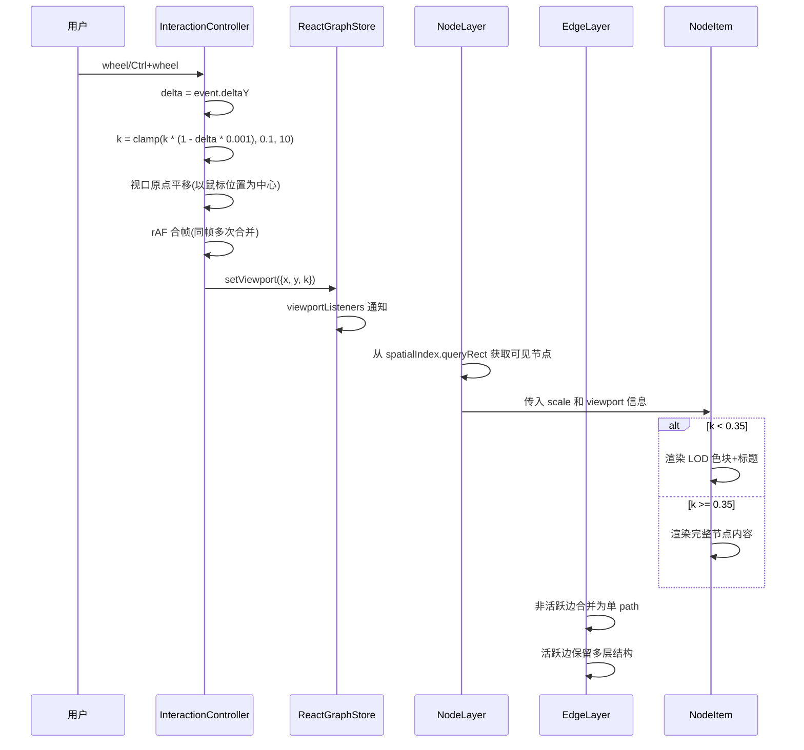
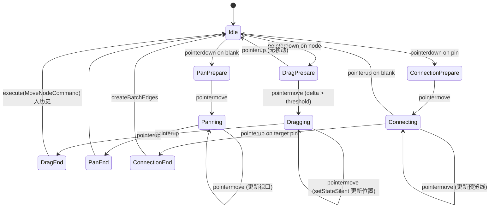
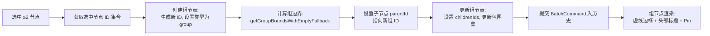
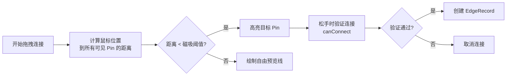
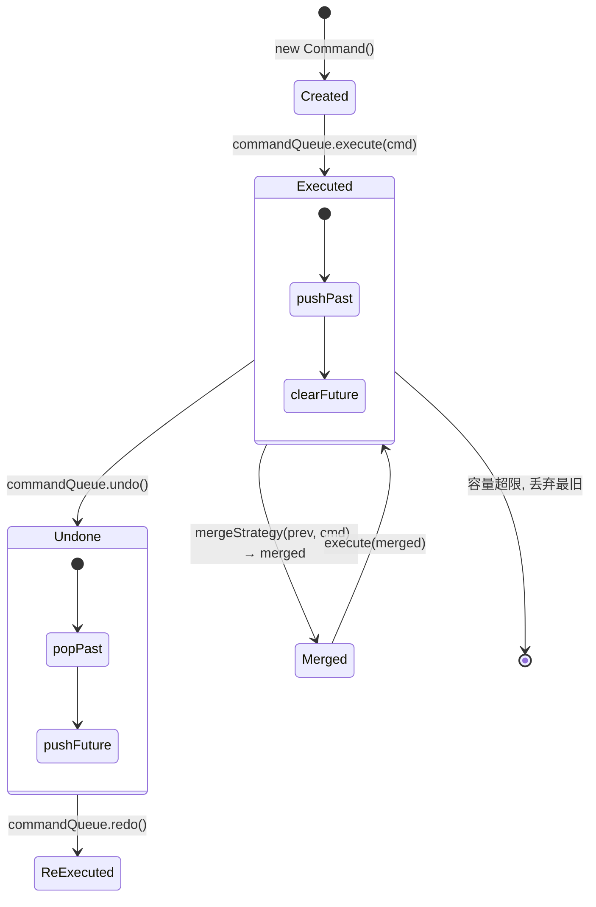
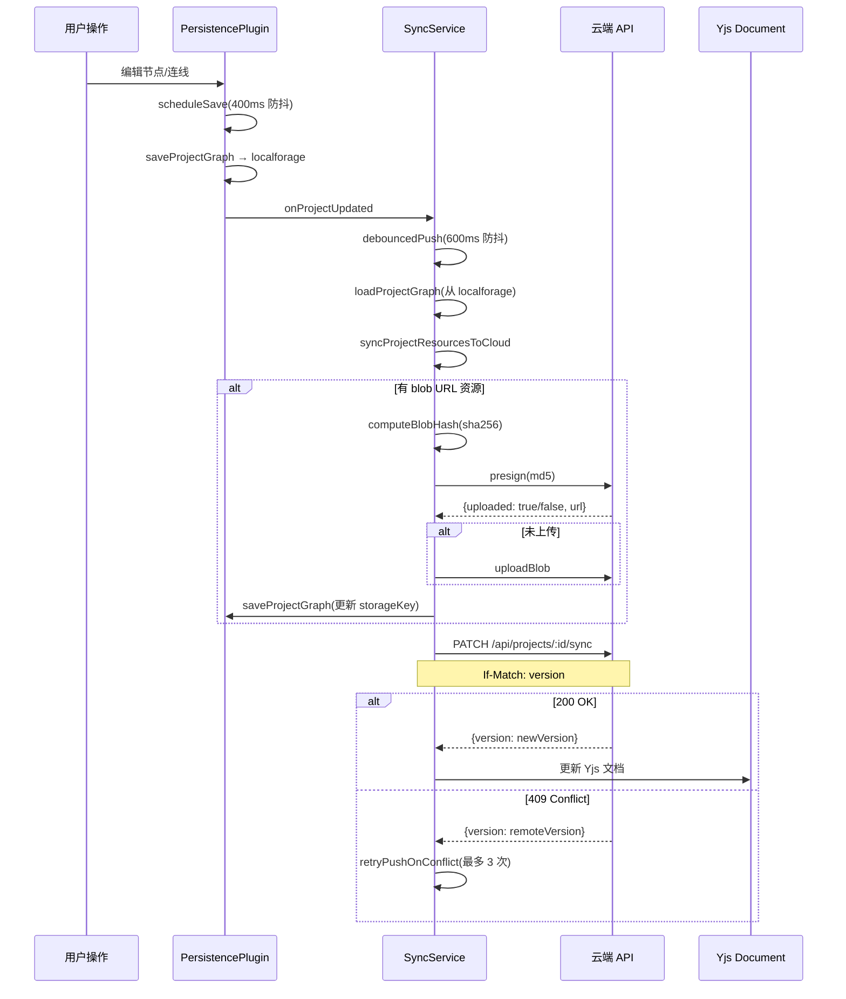
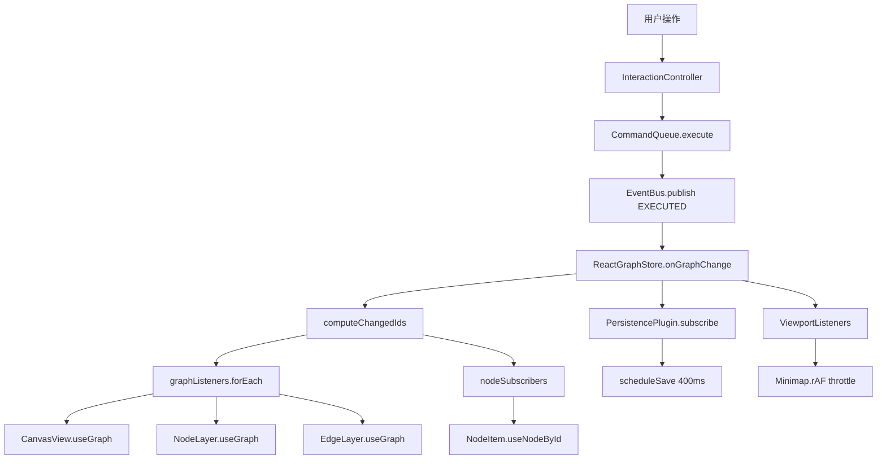

<p align="center">
  
  
  
  
</p>

<h1 align="center">ZeroExo Canvas</h1>

<p align="center">插件化无限画布编辑器 —— 节点编排 · AI 生成 · 素材管理</p>

## 快速开始

```bash
pnpm install
pnpm --filter @zeroexo/app-canvas dev    # http://localhost:5180
```

## 初始账户

初始账户由后端 seed 脚本自动创建，密码通过 `SEED_SUPER_ADMIN_PASSWORD` 环境变量指定。

***

## 核心模块与算法

### 自研画布渲染引擎

自研 React DOM 画布管线，不使用 ReactFlow，基于 `useSyncExternalStore` 实现细粒度状态订阅。

**核心算法：**

| 算法                | 说明                                                                                                       | 复杂度             |
| ----------------- | -------------------------------------------------------------------------------------------------------- | --------------- |
| **视口变换**          | CSS `transform: translate(${tx}px, ${ty}px) scale(${k})` 实现世界坐标→屏幕坐标映射，contain: layout style paint 隔离渲染层 | O(1)            |
| **节点裁剪(Culling)** | 将视口矩形逆变换到世界坐标，过滤完全位于视口外的节点；使用 `GridSpatialIndex.queryRect` 替代全量遍历                                        | O(Gq+H)         |
| **多级 LOD**        | `k < 0.35` 时渲染轻量色块+标题，`k >= 0.35` 渲染完整节点内容；视口外节点彻底卸载(DOM 移除、video 销毁)                                    | O(1) per node   |
| **非活跃边合并**        | 非选中/非悬停边的 SVG path 合并为单条 `M...C...` 拼接路径；独立透明命中 path 保留交互区域                                              | SVG 元素 -60%     |
| **网格空间索引**        | 500x500 世界坐标网格分桶，用 `gridX = Math.floor(x / CELL_SIZE)` 计算单元索引，`queryRect` 按覆盖网格快速查询                      | O(Gq+H)         |
| **per-node 订阅**   | `nodeSubscribers: Map<string, Set<Listener>>`，graph 变更时 `computeChangedIds` 计算出变化的节点 ID，仅通知对应订阅者         | O(C) per change |
| **帧率合帧**          | `requestAnimationFrame` 合并同一帧内多次 `setViewport` 调用，`lastDrawTimeRef` 记录上次绘制时间，帧间隔 < 33ms 的更新推迟            | ≤30fps          |

**拖拽交互执行流：**



**缩放交互执行流：**



***

### 交互系统 (Interaction System)

**核心算法：**

| 算法              | 说明                                                                                             | 文件                         |
| --------------- | ---------------------------------------------------------------------------------------------- | -------------------------- |
| **瞬态拖拽**        | `pointermove` 期间通过 `setStateSilent` 直写 position，`pointerup` 提交合并的 `MoveNodeCommand`，消除命令队列每帧重建 | `controller.ts`            |
| **缩放**          | `wheel` 事件 delta 计算缩放系数 `k *= (1 - delta * 0.001)`，以鼠标位置为中心调整视口，`clamp(0.1, 10)`               | `controller.ts`            |
| **命中检测**        | `GridSpatialIndex.queryRect` 查询候选节点，结合 AABB 精确过滤，500 节点框选 < 1ms                                | `selection/controller.ts`  |
| **框选(Marquee)** | `pointerdown` 记录起点，`pointermove` 更新矩形，`pointerup` 用空间索引 `queryRect` 获取命中节点                     | `selection/controller.ts`  |
| **连接验证**        | `connection-rules.ts` 维护类型兼容性矩阵，`validateGroupConnection` 禁止 input→input 等不合理连接                | `connection/controller.ts` |

**拖拽状态机：**



***

### 分组系统 (Group System)

**核心算法：**

| 算法               | 说明                                                                   | 复杂度  |
| ---------------- | -------------------------------------------------------------------- | ---- |
| **组展开(Expand)**  | 遍历组内所有后代节点，收集 `descendantIds`（递归收集子组内的子节点），将组内节点移出组                  | O(N) |
| **组收缩(Shrink)**  | 选中节点创建新组，`getGroupBoundsWithEmptyFallback` 计算边界，子节点 `parentId` 指向新组  | O(N) |
| **组边界计算**        | 遍历所有子节点，取 `minX/maxX/minY/maxY`，加上 `padding` 和 `headerHeight` 得到组包围盒 | O(N) |
| **组拖拽**          | `MoveGroupCommand` 计算 `dx/dy` 偏移，遍历所有组后代节点同名偏移，命令合并策略优化              | O(N) |
| **组缩放**          | `ResizeGroupCommand` 按比例缩放组内所有子节点的位置和尺寸                              | O(N) |
| **ReplaceScene** | 原子替换场景内所有节点，支持撤销恢复                                                   | O(N) |

**组创建执行流：**



***

### 连线系统 (Connection System)

**核心算法：**

| 算法             | 说明                                                             | 文件                         |
| -------------- | -------------------------------------------------------------- | -------------------------- |
| **贝塞尔路径计算**    | 根据源/目标节点的 Pin 位置计算三次贝塞尔曲线控制点，支持 `top/bottom/left/right` 四个方向   | `edge-layer.tsx`           |
| **连接验证**       | `connection-rules.ts` 维护 5x5 类型兼容性矩阵，`canConnect` 检查源→目标方向是否合法 | `connection-rules.ts`      |
| **组 Pin 批量连接** | 组 Pin 作为代理连接点，`createBatchEdges` 遍历组内所有子节点，为每个子节点创建对应 Pin 连接   | `connection/controller.ts` |

**Pin 磁吸算法：**



***

### 命令队列 (Command Queue)

**核心算法：**

| 算法                 | 说明                                                                              | 复杂度  |
| ------------------ | ------------------------------------------------------------------------------- | ---- |
| **执行**             | `execute(command)` 调用 `command.execute(state)` 返回新 state，入 `past` 栈，清空 `future` | O(N) |
| **撤销**             | `undo()` pop `past` 栈顶，调用 `command.undo(state)` 返回旧 state，入 `future` 栈          | O(N) |
| **重做**             | `redo()` pop `future` 栈顶，调用 `command.execute(state)` 返回新 state，入 `past` 栈       | O(N) |
| **合并策略**           | `mergeStrategies` 遍历注册的策略，返回非 null 的合并命令；撤销 prev 后执行 merged，避免 delta 双重应用       | O(N) |
| **setStateSilent** | 直接返回新 state 不入历史，不触发 EXECUTED 事件，供瞬态拖拽使用                                        | O(N) |

**命令生命周期：**



***

### 云同步与协作引擎

**核心算法：**

| 算法                             | 说明                                                                                       | 复杂度          |
| ------------------------------ | ---------------------------------------------------------------------------------------- | ------------ |
| **Yjs CRDT 同步**                | 基于 Yjs 的冲突自由合并算法，`Y.Doc` 管理 `Y.Map` 结构，`HocuspocusProvider` 建立 WebSocket 连接              | O(ops)       |
| **BroadcastChannel Leader 选举** | 启动时随机延迟 `random(0, 2000)ms` 后广播 Leader 声明，心跳 30s 续期，Leader 挂掉后 Follower 重新选举             | O(1)         |
| **版本乐观锁**                      | HTTP PATCH 携带 `If-Match: version` 头，后端 409 响应时自动重试最多 3 次，`retryPushOnConflict` 读取最新版本后重试 | O(1)         |
| **CAS 去重**                     | `computeBlobHash` 对 blob 进行 SHA-256 哈希，`presign` 接口云端检查哈希是否已存在，命中则跳过上传                   | O(blob size) |
| **防抖时序**                       | 持久化防抖 `400ms` → 云端推送防抖 `600ms`，保证 `推送防抖 > 持久化防抖 + 100ms` 安全余量                            | O(1)         |
| **删除追踪**                       | `pendingDeleteCloudIds` 持久化到 `localStorage`，pull 时跳过这些 ID，异步重试删除直到成功                     | O(N)         |

**云同步执行流：**



***

### 数据持久化

**核心算法：**

| 算法        | 说明                                                        | 文件                     |
| --------- | --------------------------------------------------------- | ---------------------- |
| **防抖保存**  | 400ms 防抖合并频繁编辑，`scheduleSave` 设置定时器，每次编辑重置定时器             | `persistence/index.ts` |
| **图片存储**  | 将图片存入 IndexedDB（`localforage`），生成 blob URL 供前端引用，支持缩略图解析  | `image-storage.ts`     |
| **缩略图解析** | 优先从内存缓存获取缩略图，否则从 IndexedDB 加载并生成，`createImageBitmap` 异步解码 | `image-storage.ts`     |
| **图片删除**  | 同步删除指定 `storageKey` 的图片及其缩略图，释放内存和 IndexedDB 空间           | `image-storage.ts`     |

***

### 层级面板

**核心算法：**

| 算法       | 说明                                                                                    | 复杂度            |
| -------- | ------------------------------------------------------------------------------------- | -------------- |
| **树构建**  | 从 `nodes` 数组中构建嵌套树结构：遍历节点，`parentId` 为 null 的为根节点，有 `parentId` 的挂到对应父节点 `children` 数组 | O(N)           |
| **搜索过滤** | 对树进行深度优先遍历，匹配节点名称或类型过滤，保留匹配节点及其祖先路径                                                   | O(N)           |
| **虚拟滚动** | `react-virtuoso` 将扁平化后的 `filteredTree` 数组虚拟化，500 节点仅渲染视口内 \~20 行                      | O(V) per frame |
| **索引查找** | `store.getNode(node.id)` 替代 `nodes.find()`，`childrenCountMap` 预计算避免每帧遍历               | O(1)           |

***

### 迷你地图 (Minimap)

**核心算法：**

| 算法         | 说明                                                                        | 复杂度    |
| ---------- | ------------------------------------------------------------------------- | ------ |
| **帧率节流**   | `lastDrawTimeRef` + `pendingRafRef` 实现 rAF 合帧，同帧多次数据变更只绘制一次，帧间隔 < 33ms 推迟 | ≤30fps |
| **节点矩形绘制** | 将节点世界坐标按 `scale = viewSize / worldBounds` 缩放到缩略图坐标，绘制半透明圆角矩形              | O(N)   |
| **视口指示器**  | 当前画布视口在小地图上用虚线边框 + 半透明填充标识，支持拖拽导航                                         | O(1)   |

***

### 富文本编辑器

**核心算法：**

| 算法                     | 说明                                                                      | 文件                       |
| ---------------------- | ----------------------------------------------------------------------- | ------------------------ |
| **contentEditable 编辑** | 自研轻量编辑器，使用 `contentEditable` + `document.execCommand` 实现基础格式化（粗体/斜体/列表） | `SelfRichTextEditor.tsx` |
| **HTML 快照渲染**          | 非编辑态直接渲染 `dangerouslySetInnerHTML`，保留所有富文本格式，不挂载编辑器实例                   | `text-node-view.tsx`     |
| **剧本格式化 CSS**          | `script-viewer.css` 通过 CSS class 控制剧本标题/对话/角色样式，无需 Quill 驱动             | `script-viewer.css`      |

***

### 事件总线 (Event Bus)

**核心算法：**

| 算法        | 说明                                                                                                                                            | 复杂度  |
| --------- | --------------------------------------------------------------------------------------------------------------------------------------------- | ---- |
| **发布/订阅** | `Map<EventType, Set<Handler>>` 维护事件处理器，`publish` 遍历处理器调用，`subscribe` 返回取消函数                                                                   | O(H) |
| **同步/异步** | 处理器支持同步和异步两种模式，`publishSync` 同步调用，`publishAsync` 异步调度                                                                                         | O(H) |
| **事件类型**  | `CommandEvents`(EXECUTED/UNDONE/REDONE)、`GraphEvents`(NODE\_UPDATED/EDGE\_ADDED/REMOVED)、`ViewportEvents`(CHANGED)、`SelectionEvents`(CHANGED) | -    |

**事件传播架构：**



***

## 技术栈

- **前端框架**: React 18 + TypeScript 5
- **构建工具**: Vite 6
- **画布引擎**: 自研 React DOM 管线（未使用 ReactFlow）
- **实时协作**: Yjs + Hocuspocus + BroadcastChannel
- **状态管理**: Zustand + useSyncExternalStore + 自研 ReactGraphStore
- **UI 组件**: Ant Design 6 + Lucide Icons
- **虚拟化**: react-virtuoso
- **持久化**: localforage + IndexedDB (y-indexeddb)
- **后端**: NestJS + PostgreSQL + Prisma + Redis
- **样式**: CSS-in-JS + 主题系统

> 文档、架构说明详见项目根目录 [docs/](../docs/README.md)。

